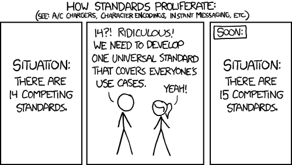

```{r setup, include=FALSE}
knitr::opts_chunk$set(echo = TRUE)
```

$$\\[2in]$$

## Lab meeting outline

- #### **Presentation**: Background & motivation
- #### **Demo**: Overview of package functions
- #### **Discussion**: How can `TidyMultitude` help with your research?

$$\\[4in]$$

# **Presentation**: Background & motivation

> `TidyMultitude` is an R package providing `dplyr`-like tools for manipulation of 
[`MultiAssayExperiment`](http://bioconductor.org/packages/release/bioc/html/MultiAssayExperiment.html)
and [`SummarizedExperiment`](http://bioconductor.org/packages/release/bioc/html/SummarizedExperiment.html)
objects.

$$\\[4in]$$


# About experiment containers

<br>

#### Experiment objects are:

- #### Data containers
- #### Store and coordinate biological assay information
- #### Relational database of experimental data

$$\\[3in]$$

## The `SummarizedExperiment` object

<div style="text-align: center;">


</div>

$$\\[3in]$$

<div style="text-align: center;">



</div>

#### There are [many different experiment containers](https://www.notion.so/BioC-Data-Structures-5f98b463f5364b2e8c6ccbe1768ef772), most of which are variations on the `SummarizedExperiment`:

- #### `RaggedExperiment`
- #### `TreeSummarizedExperiment`
- #### `ClusterExperiment`
- #### `SingleCellExperiment`
- #### `GenomicRanges`
- #### `GenomicAlignments`
- #### `SeuratObject`
- #### `VariantExperiment`
- #### `TreatmentResponseExperiment`
- #### `PhIPData`
- #### `MSnExp`

$$\\[4in]$$

### **Problem**: Too many experiment containers.

### **Solution**: Make an container to hold all your experiment containers.

$$\\[4in]$$

## The `MultiAssayExperiment` object

<br>

- #### A container of experiment objects.
- #### Feature data (`rowData`) is specific to each experiment, but all assays should be performed on the same pool of samples (`colData`).

<div style="text-align: center;">


</div>

$$\\[4in]$$

- #### Experiment objects: containers for assays;
- #### `MultiAssayExperiment` objects: containers for experiment objects;
- #### `TidyMultitude`: a toolkit for wrangling `MultiAssayExperiment` objects.

$$\\[4in]$$

### What kind of wrangling?

<br>

#### Within a `MultiAssayExperiment`:

- #### Subset an experiment by feature data.
- #### Apply normalizing functions to assays.
- #### Reordering or subsetting experiments.

$$\\[4in]$$

# [**Demo**](https://github.com/MTurner0/Talks/blob/main/tidymultitude_alpha_demo/live-coding-demo.R): Overview of package functions

```{r, eval = FALSE}
library(TidyMultitude)

data("mae")
print(mae)
help("mae")
str(mae)
```

$$\\[3in]$$

## Subsetting: `select` and `pull`

<br>

#### `select` experiments in a `MultiAssayExperiment` object.

<br>

```{r, eval=FALSE}
mae %>%
  select(phy16S)
```
<br>

#### `pull` experiments out of a `MultiAssayExperiment` object.

<br>

```{r, eval=FALSE}
mae %>%
  pull(phy16S)

mae %>%
  pull()
```

$$\\[3in]$$

## Transform assays and experiments: `mutate` and `transmute`

#### Operating on experiments:

```{r, eval=FALSE}
names(mae)

mae %>% mutate(subset = cyto[1:5, 1:3])
```

#### Operating on assays:

```{r, eval=FALSE}
mae %>%
  pull() %>%
  assays()

mae %>% mutate(cyto, plus_one = cyto_conc + 1)

mae %>%
  pull() %>%
  mutate(plus_one = cyto_conc + 1)
```

$$\\[3in]$$

## Subset experiment data by samples and features: `filter_colData` and `filter_rowData`

<br>

#### Experiments' sample and feature data are dataframes.

```{r, eval=FALSE}
filter_colData(mae, Visit == 1)

mae %>%
  filter_rowData(phy16S, Class == "Bacilli") %>%
  filter_rowData(cyto, cytokine %in% c("IFN-g", "TNF-a"))
```

<br>

#### These functions also work on individual `SummarizedExperiment` objects.

```{r, eval=FALSE}
mae %>%
  pull() %>%
  filter_rowData(cytokine %in% c("IFN-g", "TNF-a"))
```

$$\\[3in]$$

## Arrange experiment data by samples and features: `arrange_colData` and `arrange_rowData`

<br>

```{r, eval=FALSE}
arrange_colData(mae, Visit)

arrange_rowData(mae, cyto, cytokine)

mae %>%
  pull() %>%
  arrange_rowData(cytokine)
```

$$\\[3in]$$

## Notes

<br>

- #### The units of a `MultiAssayExperiment` are not necessarily `SummarizedExperiment`s.
  - #### e.g. `MSnSet` and `MSnExp`
- #### `rowData` and `colData` are properties of `SummarizedExperiment`-like containers.

<br>

```{r, eval=FALSE}
methods("arrange_colData")
```

<br>

- #### `mutate`, `transmute`, `select`, `pull` should work on any `MultiAssayExperiment` object regardless of constituent container types.

$$\\[4in]$$

## Resources

<br>

- #### For help, Slack or email Margaret
- #### Package vignette

```{r, eval=FALSE}
# devtools::install_github("MTurner0/TidyMultitude", build_vignettes = TRUE)

vignette("workflow-1-MOMS-PI", package = "TidyMultitude")
```


$$\\[4in]$$

# [Discussion](https://docs.google.com/document/d/1-QWO9rgzCrDFtv9BwDAa96bv4B9KFympYvpdDYrQ7W4/edit?usp=sharing): How can `TidyMultitude` help with your research?
